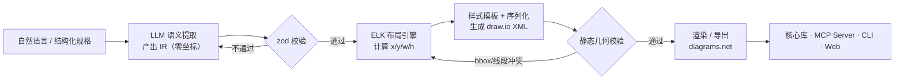

# AI-Diagram（待定）：基于 LLM + ELK 的自动布局画图工具 · 技术设计文档

> 版本：v0.2（设计稿） · 目标：开源（OSS）
> 定位：解决"LLM 直接输出坐标导致图重叠 / 连线穿框 / 布局不美观"的痛点。核心思路——**LLM 只负责理解语义并产出零坐标的中间表示（IR），坐标 100% 交给 ELK 布局引擎用数学算出来**。
>
> **设计准则（v0.2 收敛）**：目的与痛点非常明确，因此本项目**只做两件事**——① 我们的特色：**LLM + ELK 自动布局**（语义/几何解耦）；② 基础的 **draw.io 兼容能力**（生成标准 `.drawio`、可打开、可编辑、可导出）。除此之外一律视为冗余，不进核心，详见第 3 节「范围边界与非目标」。

---

## 1. 项目定位与目标

**一句话定位**：把"自然语言 / 结构化需求"变成"不重叠、布局合理、风格统一、可在 draw.io 中继续编辑"的图。

- **目标用户**：开发者、架构师、技术写作者、需要把脑子里的系统画出来的任何人；以及希望让 AI Agent 具备"画图能力"的产品。
- **核心指标**：
  - 不重叠率（几何硬性指标，由引擎保证 ≈ 100%）
  - 连线穿框率（正交路由 + ports 约束，趋近 0）
  - 美观度（样式模板 + 一致性，主观但可评测）
  - 单图 token 成本（IR 紧凑，远低于直接吐 XML）
  - 大图可扩展性（>50 节点仍可产出可读图）

---

## 2. 核心痛点与设计哲学

### 2.1 痛点回顾

LLM 在"空白画布上推理坐标"是其弱项：容易把多个节点落进同一区域（重叠）、盲配连线出入口（穿框）、缺乏统一网格（失衡）。参考项目 `next-ai-draw-io` 在 Web 路径里让 LLM 在 prompt 约束下"硬猜坐标"，质量上限受限于 LLM 的空间推理能力——这正是本项目的切入点。

### 2.2 两条设计原则

1. **语义与几何解耦**：LLM 只决定"有什么、谁连谁、属于哪类"（语义拓扑）；坐标、间距、路由全部交给专业图布局引擎。
2. **坐标责任交给专业引擎**：凡涉及"把框放在哪"的决定，一律由 ELK 的确定性算法产出，LLM 不碰坐标。

---

## 3. 范围边界与非目标（Scope & Non-Goals）

> 本项目目的单一、痛点明确，因此**刻意保持小而锋利**。判断一个功能要不要做，只问一句：**它是否直接服务于"让 LLM 画出的图不重叠、布局合理"或"生成的图是标准可编辑的 draw.io"**？不是，就不做。

### 3.1 核心范围（做，且必须做好）

| 能力                      | 说明                                                  | 归属                     |
| ------------------------- | ----------------------------------------------------- | ------------------------ |
| **自然语言 → IR**         | LLM 产出零坐标语义中间表示，强 schema 校验            | 特色                     |
| **IR → ELK 自动布局**     | 坐标/间距/正交路由由 ELK 数学计算，保证不重叠、不穿框 | **特色（项目立身之本）** |
| **IR → 标准 draw.io XML** | 输出合法 `mxGraphModel`，样式模板按类型配色           | 基础 draw.io             |
| **在 draw.io 中继续编辑** | 生成物是标准 `.drawio`，任意 draw.io 实例可打开/改/存 | 基础 draw.io             |
| **导出 PNG / SVG**        | 客户端导出，无需服务端                                | 基础 draw.io             |
| **静态几何校验**          | 零成本的 bbox 重叠 / 线段交叉检测，兜底质量           | 特色配套                 |

### 3.2 明确非目标（不做，或仅在有真实需求时才考虑）

| 不做的东西                                   | 原因                                                                                    |
| -------------------------------------------- | --------------------------------------------------------------------------------------- |
| **模板市场 / 素材商店**                      | 与核心痛点无关，是运营功能，纯属膨胀                                                    |
| **实时协同编辑 / 多人光标**                  | draw.io 本身及其生态已解决；重复造轮子                                                  |
| **图的版本管理 / 历史回溯**                  | 交给 Git 或用户自己的存储；核心库只管"生成一张好图"                                     |
| **富文本编辑器 / 自研画布**                  | 编辑能力直接复用 draw.io，绝不自研渲染/编辑器                                           |
| **UML 全家桶 / 时序图 / 网络拓扑等图种扩展** | 首发只锚定 **ER 图 + 流程图**（layered 布局最擅长）；其他图种是"以后再说"，非承诺       |
| **账号体系 / 团队空间 / 权限**               | 产品化运营范畴，开源核心不碰；BYOK 已让服务端零状态                                     |
| **复杂的 VLM 视觉纠错闭环**                  | 成本高、收益边际递减；核心质量由 ELK + 静态校验保证，VLM 最多作为远期可选实验，不进 MVP |

### 3.3 "基础 draw.io 功能"的准确含义

指的是**与 draw.io 生态无缝对接**，而**不是重写 draw.io**：

- 生成的文件 100% 是标准 draw.io 格式，双击即可用官方桌面端 / 网页端 / VSCode 插件打开；
- 编辑、协同、导出等"重活"全部委托给 draw.io 本体，我们只负责"把第一张图画对画好看"；
- 渲染引擎直接用 diagrams.net（embed 或自托管 docker），**不自研任何渲染/编辑内核**。

---

## 4. 整体架构（宏观）



数据流向是**单向确定管道 + 一个零成本反馈环**：除 L4 静态校验回灌外，每一层都是纯函数式转换，易于测试与推理。VLM 视觉校验不在主管道内（远期可选）。

**双向编辑管线（与生成管线共用核心）**：当用户对已有 `.drawio` 文件做增量修改时，管线反向运行——从 XML 提取语义拓扑（cell 的 id / label / type / 边关系）还原为 IR → 接受编辑指令（add / update / delete 原子操作）→ 重新走 L2 布局 + L3 序列化，产出更新后的 XML。这保证了"用户在 draw.io 中手动改过的内容不会丢失"，AI 的修改叠加在手动编辑之上。

---

## 5. 完整技术栈

> 精简原则：只保留服务于"特色 + 基础 draw.io"的依赖。带 ★ 的是**核心必需**，其余为轻量入口或可选。

| 层 / 领域           | 选型                                 | 许可证      | 选型理由                                                                  | 优先级     |
| ------------------- | ------------------------------------ | ----------- | ------------------------------------------------------------------------- | ---------- |
| 语言 / 运行时       | TypeScript + Node.js 20 LTS          | MIT         | 类型安全；前后端同语言，核心库可同时跑在 Node 与浏览器                    | ★          |
| 包管理 / Monorepo   | pnpm workspace + Turborepo           | MIT         | 多包（core / mcp / cli / web）复用同一核心，增量构建                      | ★          |
| LLM 抽象            | Vercel AI SDK（`ai`）                | MIT         | provider 无关；原生 structured output，配合 zod 直接出强类型 IR           | ★          |
| Schema / 校验       | zod                                  | MIT         | 与 AI SDK 深度集成；IR 定义即校验器                                       | ★          |
| 布局引擎            | **elkjs**                            | **EPL-2.0** | 数学保证不重叠；支持 ports（显式连接点）做干净正交路由；ER/流程图天然适配 | ★ 立身之本 |
| XML 解析 / 几何校验 | fast-xml-parser / linkedom           | MIT         | 静态 bbox 重叠、线段交叉检测                                              | ★          |
| 渲染                | diagrams.net 自托管（docker）/ embed | Apache-2.0  | 免费、可离线、对"你生成的图"不主张版权；**不自研渲染内核**                | ★          |
| MCP 接入            | @modelcontextprotocol/sdk            | MIT         | 把能力暴露给任意支持 MCP 的 Agent                                         | 主交付     |
| CLI                 | commander + tsx                      | MIT         | 轻量命令行入口                                                            | 轻量入口   |
| Web 应用            | Next.js（React）                     | MIT         | 最简对话式预览 + BYOK 代理；**不做版本管理/账号**                         | 轻量入口   |
| 测试                | Vitest                               | MIT         | IR→XML 快照测试、golden 图回归                                            | ★          |
| VLM（远期可选）     | 同 AI SDK 视觉模型                   | —           | 视觉校验兜底；**非 MVP，收益边际递减**                                    | 可选       |
| CI / 文档站         | GitHub Actions / Docusaurus          | 免费 / MIT  | 自动化与文档                                                              | 可选       |

> 全部为开源、零付费依赖。唯一产生费用的是用户自带的 LLM API Key（BYOK），不经项目方。

---

## 6. 各层技术方案（宏观思路，不含实现代码）

### 6.1 L1 语义提取层（LLM → IR）

- **IR 设计原则**：只描述语义，不描述几何。字段包括节点（id / label / type / group）、边（source / target / label / kind）、分组（id / label / members）、以及可选的方向/风格提示。
- **Provider 抽象**：通过 AI SDK 屏蔽 OpenAI / Anthropic / 混元 / DeepSeek 差异；项目只依赖"支持 structured output 的模型"。
- **结构化输出**：用 zod schema 驱动 `generateObject`，让模型直接产出合法 JSON，而非先吐文本再解析。
- **校验与回灌**：zod 校验不通过（如边指向不存在的节点、缺失必填字段）即带错误信息回灌模型重试；重试上限后降级为"让用户补全"。

### 6.2 L2 布局引擎层（ELK）— 项目立身之本

- **图类型自动推断**：LLM 根据输入语义自动判断应产 ER 图还是流程图，用户无需手动选择；布局方向（LR / TB）随图类型自适应。这一步发生在 L1 语义提取阶段，由 IR 中的 `type` 字段携带，驱动 L2 的布局参数选择。
- **首发只用一种算法**：`layered`（Sugiyama 分层）。它是 **ER 图 + 流程图**（本项目首发唯二锚定的图种）的最佳解——按依赖分列、降交叉、网格落坐标。
  - `mrtree`（树）、`force`（网状）等其它算法**不进 MVP**，仅当真出现树形/网络图需求时再按需接入（ELK 已内置，接入成本低，但现在不做）。
- **ports 与正交路由**：ELK 支持在节点边框上定义显式连接点（ports）。把"外键边从右侧出、主键边从左侧入"这类约束交给 ports，配合正交边路由，使连线走横平竖直、不穿框。这是"美观"的关键。
- **布局参数**：固定 `spacingNodeNode` / `spacingEdgeNode` / 画布边距，保证视觉节奏一致；方向（LR / TB）由图类型自适应。
- **性能与规模**：ELK 处理数百节点在毫秒~秒级；<100 节点可在主线程直跑，更大规模用 worker pool。

### 6.3 L3 样式与序列化层

- **样式模板表**：建立 `type → draw.io style` 的映射（如实体表=浅蓝底+表头行、服务=圆角、判定=菱形、外键边=深灰虚线）。样式与几何解耦——ELK 只给坐标，本层按类型"穿衣"。保持一套克制的默认模板即可，不做可视化主题编辑器。
- **XML 生成思路**：基于开放的 mxGraphModel 格式拼装 `<mxCell>`；节点尺寸由"标签字数 × 类型默认高度"推算后回填给 ELK（形成 IR→尺寸→布局→XML 的小闭环）。根节点（id=0/1）由程序补全。
- **一致性 + 兼容性**：同 group 用同色系，分组渲染为 draw.io 容器/泳道；输出务必是**标准 mxGraphModel**，确保任意 draw.io 实例能原样打开、编辑、再保存。

### 6.4 L4 质量校验（只做零成本静态校验）

- **静态几何校验（必做）**：解析生成的 XML，计算各顶点 bbox 做两两相交检测；边做线段相交检测。输出具体冲突 ID，供回灌 L2 微调参数或提示用户。零成本、确定性，是核心质量兜底。
- **VLM 视觉校验（远期可选，非 MVP）**：渲染成 PNG 让视觉模型判读重叠/穿框再回灌——成本高、边际收益递减，且 ELK + 静态校验已能覆盖绝大多数问题。**明确不进 MVP**，仅作为后期实验保留可能性。

### 6.5 L5 渲染与导出层（复用 draw.io，绝不自研）

- **渲染方案**：
  - `embed.diagrams.net`（免费，无 SLA）：最快接入，适合 MVP 与 Web 预览。
  - **自托管 `jgraph/drawio` docker**（Apache-2.0，免费）：离线、合规、可控，生产推荐。
  - 直接产出：生成的 `.drawio` 文件可被官方桌面端 / 网页端 / VSCode 插件直接打开，渲染完全去依赖。
- **导出**：客户端即可导出 PNG / SVG，无需服务端。
- **离线/合规**：因渲染引擎可自托管、XML 格式开放，敏感数据不出内网。

### 6.6 交付形态（共用同一核心，主次分明）

- **核心库（npm）★**：暴露 `text → IR → ELK → draw.io XML` 的纯函数 API，是一切形态的根。同时暴露反向解析管线（`XML → IR`）以支持增量编辑。其余形态都是它的薄壳。
- **MCP Server（主交付，Phase 1 即交付）**：将核心能力暴露为 MCP 工具，让 AI Agent 直接调用——"LLM 出 IR、ELK 出图"的 Agent 化通道。工具按优先级分三层：① 核心链路（会话/生成/查询/增量修改/校验/导出/页面列表）② 增强功能（多页/自动布局/智能修复/搜索）③ 锦上添花（主题/页面重命名）。工具集保持最小，不堆砌。增量修改通过"获取当前图 → 原子操作数组（add / update / delete）→ 重新布局序列化"的闭环实现，保证用户手动编辑不会丢失。
- **CLI（轻量入口）**：接收文本/文件，输出 `.drawio` 或预览链接；适合脚本与 CI。
- **Web UI（轻量入口）**：仅做对话式生成 + 在线预览 + 导出；BYOK 密钥存浏览器侧，服务端零密钥。**不做版本管理、账号、协同**——这些交给 draw.io 生态或用户自有存储。

---

## 7. 数据模型：中间表示 IR（概念结构）

> 以下为概念示意，非实现代码。目的是固定"语义层契约"。

```
DiagramIR = {
  title:        string
  direction?:   "LR" | "TB"          // 布局方向，喂给 ELK
  nodes:   [ { id, label, type, group? } ]
  edges:   [ { source, target, label?, kind? } ]
  groups?: [ { id, label, members: [nodeId] } ]
}
```

- **零坐标字段**：IR 中没有任何 x/y，坐标由 L2 全权决定。
- **type / kind 驱动一切**：type 决定尺寸默认值与样式模板；kind（fk / association / flow / inherit）决定连线样式与路由策略。
- **演进考虑**：IR 可向后兼容扩展（如 `constraints`、`clusters`、`layout` 显式提示），不影响下游。

---

## 8. 关键工程难点与对策

| 难点                                    | 宏观对策                                                                                                            |
| --------------------------------------- | ------------------------------------------------------------------------------------------------------------------- |
| ELK ports → draw.io `exitX/entryX` 映射 | 写一层"端口语义 → draw.io 连接点"映射，按边方向与类型给端口约束，保证正交线不穿框（**唯一真正需要打磨的核心细节**） |
| 大图（>50 节点）可读性                  | 引导用户拆分为多张子图；分块/多页为增强项，非首发必需                                                               |
| 渲染依赖 embed 无 SLA                   | 支持自托管 diagrams.net docker 或客户端导出，彻底去依赖                                                             |
| LLM IR 质量波动                         | 强 schema + few-shot + 校验回灌；IR 紧凑，可用小/快模型控成本                                                       |
| 风格不统一                              | 集中式样式模板表，按 type/group 自动配色与圆角                                                                      |

---

## 9. 可行性评估

- **技术可行性：高**。Mermaid、PlantUML、Cytoscape、reaflow 均已用 ELK/elkjs 验证"声明/LLM → ELK → 图"的工业级链路；ELK `layered` 本就为带方向的 node-link 图 + ports 设计，与 ER/流程图高度契合。
- **工期与里程碑（聚焦版）**：
  - Phase 1 MVP（2–3 周）：核心库（IR schema + ELK layered + 标准 draw.io XML）+ 静态几何校验 + CLI + MCP Server（核心链路工具）+ 最简 Web 预览
  - Phase 2 提质（+1 周）：样式模板表 + 分组容器 + golden 图回归 + MCP 增强工具
  - Phase 3 产品化（+1 周）：自托管渲染 + PNG/SVG 导出 + 文档站 + MCP 样式主题
- **风险矩阵**：ELK worker 线程（主线程直跑即可规避）、ports 映射（唯一需打磨细节）、模型质量（校验回灌兜底）——均为可控工程风险，无技术死胡同。
- **收敛后的好处**：范围小、无冗余功能，单人 3–5 周即可交付一个"能画对 ER/流程图、且完全兼容 draw.io"的可用开源工具。

---

## 10. 许可与法律风险（已核实）

| 组件              | 许可证                     | 影响                                                               |
| ----------------- | -------------------------- | ------------------------------------------------------------------ |
| elkjs / ELK       | **EPL-2.0**（弱 copyleft） | ✅ 可商用、可闭源依赖；仅修改 ELK 自身源码才需开源改动；含专利授权 |
| ELK `libavoid`    | **LGPL**（强 copyleft）    | ⚠️ 不在 elkjs 核心包，纯依赖 elkjs 不触发；勿单独引入即可          |
| diagrams.net 源码 | **Apache-2.0**             | ✅ 可自托管/改/分发；对生成的图不主张版权                          |
| mxGraph           | **Apache-2.0**             | ✅ 无碍                                                            |
| draw.io 商标/Logo | 需书面授权                 | ⚠️ 勿以 "draw.io" 命名或挪用 Logo                                  |
| 项目自身          | 建议 **MIT 或 Apache-2.0** | 与 EPL 兼容；分发时附 ELK 的 EPL 声明（NOTICE）即可                |

**总体法律风险：低**。全链路 OSS、无强制 copyleft 传染、无商标冲突（不蹭名）、无专利雷区。

---

## 11. 成本评估

| 项目                                                             | 费用          | 承担方                       |
| ---------------------------------------------------------------- | ------------- | ---------------------------- |
| 所有代码依赖（elkjs / diagrams.net / zod / AI SDK / MCP SDK 等） | 免费 OSS      | 无                           |
| 渲染（自托管 docker / 桌面端 / 客户端导出）                      | 免费          | 无                           |
| LLM 推理（IR 生成）                                              | 按 token 计费 | **最终用户 BYOK**，项目方 $0 |
| 托管 Web 服务（可选）                                            | 服务器成本    | 项目方（商业决策，非必需）   |

**结论**：开源项目本身零成本，无付费库、无强制第三方服务。

---

## 12. 与 next-ai-draw-io 的关系

- **可复用**：其 MCP 通道思路、渲染机制均值得借鉴。
- **核心差异**：本项目在 LLM 与渲染之间插入"IR + ELK 自动布局"层，把坐标责任从 LLM 剥离——补上其最弱的一环。
- **定位**：不是 fork，而是"更彻底的语义/几何解耦、且刻意保持小而聚焦"的同类工具。

---

## 13. 路线图（聚焦版）

- **Phase 0**：仓库脚手架（monorepo）、IR schema、ELK→标准 draw.io XML 最小可跑样例。
- **Phase 1（MVP）**：核心库（layered 布局 + 静态几何校验）+ CLI + **MCP Server（核心链路工具：会话/生成/查询/增量修改/校验/导出/页面列表）** + 最简 Web 预览（embed 渲染）。锚定 **ER 图 + 流程图**。
- **Phase 2（提质）**：样式模板表 + 分组容器 + golden 图回归 + MCP 增强工具（多页/自动布局/智能修复/搜索）。
- **Phase 3（产品化）**：自托管渲染 + PNG/SVG 导出 + 文档站 + MCP 样式主题。

> **到 Phase 3 即为"完成态"**——特色（LLM + ELK 自动布局）与基础 draw.io 兼容能力均已闭环。

**明确列为"非承诺、视真实需求再议"的后续（不属于当前范围）**：

- 更多图种（UML / 时序图 / 网络拓扑）与对应布局算法（tree / force）；
- VLM 视觉校验实验；
- 大图自动分块多页。

以上一律遵循第 3 节的判据：不直接服务于核心痛点，就不进主线。示例库属于文档配套，可随时补，不单列为里程碑。

---

## 14. 实现差异记录（v0.3，Step 0–3 实际实现）

> 本章节记录实际编码过程中与技术方案的偏离，供后续会话理解设计意图变化。

### 14.1 坐标体系：中心点 vs 左上角

**设计原意**：ELK 输出坐标直接写入 draw.io XML。

**实际实现**：ELK 输出左上角坐标，但在 `layoutDiagram()` 中统一转换为中心点坐标系的 `LayoutNode`。序列化器构建 mxCell 时再转回左上角。

**原因**：中心点坐标系使下游运算（bbox 计算、group 包围盒、碰撞检测）更对称；draw.io 需要左上角，转换由序列化器负责，布局层保持语义清晰。

### 14.2 LLM Provider：BaseLLMProvider 抽象基类

**设计原意**：`LLMProvider` 接口 + 独立实现类。

**实际实现**：增加了 `BaseLLMProvider` 抽象基类，将 `generateIR` 的编排逻辑（prompt 构建、超时控制、错误分类、重试循环）提取到基类，子类只需实现 `createModel()`。

**原因**：避免多个 Provider 实现中重复编排代码；新增 Provider 只需关心"如何创建对应厂商的 AI SDK Model"。

### 14.3 序列化器：分组容器先于节点生成

**实际实现**：`serialize()` 中严格按"容器 → 节点 → 边"顺序生成 cell。

**原因**：mxCell 的 `parent` 引用必须指向已存在的 cell。group 内节点的 parent 指向 group id，所以 group 容器 cell 必须在节点 cell 之前生成。这是 draw.io XML 格式的隐式约束。

### 14.4 边的 parent 始终为图层根（"1"）

**实际实现**：所有边的 `parent="1"`，即使其 source/target 节点在 group 内。

**原因**：draw.io 边不能放入容器（会失去路由能力），这是 mxGraph 的底层限制。

### 14.5 同 group 节点同色系（FR-11）未实现

**设计原意**：同一 group 的节点使用同一色系的不同深浅。

**当前状态**：`GroupStyleTemplate` 定义了分组容器样式，但未对组内节点的颜色做统一处理。节点样式仍按自身 `type` 独立决定。

**原因**：此功能为 P1 分组布局的增强项（PRD FR-11），需在 group 内子图独立布局完成后（S2-12）再实现颜色统一。当前不影响 ER 图和流程图的基础效果。

### 14.6 DrawioPortCoords 映射已验证

**设计原意**：建立 4 方向 × 4 结构（ER-TB/ER-LR/Flow-TB/Flow-LR）的验证矩阵。

**当前状态**：`PORT_SIDE_MATRIX` 完成了 4 方向 × 2 角色（source/target）的静态映射表，单元测试全覆盖。但不同图类型+方向组合的真实 draw.io 打开验证仅做手动抽查，未建立自动化验证矩阵。

**原因**：自动化验证需启动 draw.io headless 渲染并截图对比，属于 Phase 3 产品化范围。

### 14.7 技术文档产出

Phase 0–3 实现完成后，按标准软件工程文档规范补充了系统设计文档体系（2026-07-12）：

| 文档 | 路径 | 说明 |
|------|------|------|
| 系统设计说明书 | `docs/design/ai-diagram-system-design.md` | 架构总览、模块划分、数据流、扩展点 |
| M1 详细设计：共享契约层 | `docs/design/ai-diagram-module-shared-contract.md` | IR Schema、Layout 类型、错误基类 |
| M2 详细设计：LLM 语义提取引擎 | `docs/design/ai-diagram-module-llm-extraction.md` | Ports & Adapters、反馈环、Provider 工厂 |
| M3 详细设计：ELK 自动布局引擎 | `docs/design/ai-diagram-module-elk-layout.md` | 布局算法、Port 映射矩阵、坐标转换 |
| M4 详细设计：样式引擎与序列化器 | `docs/design/ai-diagram-module-style-serializer.md` | 样式模板表、mxGraphModel 生成、cell 顺序 |
| 扩展点登记表（更新） | `docs/EXTENSION_POINTS.md` | 3 个扩展点 |

### 14.8 Step 4：静态几何校验模块（2026-07-12）

**架构**：`ValidationPort` 接口（`ports/validation.ts`）→ `StaticValidatorImpl` 实现（`adapters/static-validator-impl.ts`），遵循项目 ports/adapters 约定。

**检测器设计**：
- **重叠检测**：`aabbOverlap` 使用重叠区域计算（`overlapX = min(rights) - max(lefts)`），修正了原 plan 中 tolerance 加错侧导致边缘接触误报的 bug。语义：`overlapX > tolerance` 时视为冲突，tolerance 默认 1px。
- **穿框检测**：`segmentIntersectsBBox` 用 Cohen-Sutherland 快速排除 + 四边精确检测，自动排除端点节点（source/target 不参与穿框检测）。
- **边交叉检测**：`linesIntersect` 用叉积方向判断法，正交交叉（水平⊥垂直）免报。
- **孤节点检测**：入度=0 且出度=0 → warning（不阻塞生成）。

**smart_fix 限制**：仅支持 overlap 位移修复（沿冲突方向推开 50px 的 XML 坐标正则替换），S4-11（edge-through-node 重路由）无法在 XML 层面实现，需要重新跑 ELK 布局。

**新增依赖**：`fast-xml-parser@^5` 用于解析 mxGraphModel XML。

**测试覆盖**：248 tests（新增 33 validation tests），全部 P0 验收标准通过。

**文档产出**：

| 文档 | 路径 | 说明 |
|------|------|------|
| M5 详细设计：静态几何校验 | `docs/design/ai-diagram-module-validation.md` | 检测算法、math-utils、smart-fix |
| 模块 README | `packages/core/src/validation/README.md` | 职责、目录结构、接口、数据流、已知限制 |
| 扩展点登记表（更新） | `docs/EXTENSION_POINTS.md` | +ValidationPort（4 个扩展点）

### 14.9 Step 5: CLI 交付形态（2026-07-13）

**架构**: CLI 是核心库的薄壳，使用 `commander` + `chalk` + `ora`，所有核心逻辑委托给 `@ai-diagram/core`。

**命令实现**:
- `generate [description]`: 全链路（text → IR → layout → XML → file），支持 `-f` 文件输入、`-o` 输出路径、`-p` provider 选择、`--verbose` / `--quiet`
- `validate <file>`: 对 .drawio 文件执行静态几何校验，支持 `--tolerance` / `--label-check`
- `export <file>`: Phase 3 占位，提示用户手动导出
- `layout-only <ir-file>`: 跳过 LLM，从 IR JSON 直接生成 .drawio

**配置合并策略**: 默认值 → `ai-diagram.config.json` → 环境变量（`AI_DIAGRAM_*`） → CLI flags

**API Key 发现**: 按 provider 名映射到环境变量（`OPENAI_API_KEY` / `ANTHROPIC_API_KEY` / `DEEPSEEK_API_KEY` / `HUNYUAN_API_KEY`），未配置时给出明确错误提示

**错误码规范**: 0=成功, 1=参数, 2=LLM, 3=schema, 4=几何校验（符合 PRD S5-14）

**已知限制**:
- `provider-factory.ts` 仅注册了 openai/anthropic，deepseek/hunyuan 需先实现对应 adapter
- PNG/SVG 导出为 Phase 3 占位

### 14.10 Step 6: MCP Server (2026-07-13)

**架构**: MCP Server 是核心库的薄壳，通过 `@modelcontextprotocol/sdk` 暴露 14 个 MCP 工具，使用 stdio transport 通信。

**模块位置**: `packages/mcp-server/`

**工具实现**:
- P0 核心工具（8个）: `start_session`, `generate_diagram`, `get_diagram`, `edit_diagram`, `validate_diagram`, `smart_fix`, `export_diagram`, `list_pages`
- P1 增强工具（3个）: `add_page`, `auto_layout`, `find_cells`
- P2 锦上添花（3个）: `rename_page`, `delete_page`, `apply_theme`

**关键实现细节**:
- **Session Manager**: 内存存储（Map<id, Session>），最多 10 个并发 session，使用 `randomUUID` 生成 sessionId
- **Preview Server**: 轻量 HTTP 服务器（Node 内置 `http` 模块，零额外依赖），监听 `127.0.0.1` 的随机端口，为每个 session 提供 diagrams.net embed HTML 页面。Embed 页面通过 postMessage API 自动加载 session XML
- **generate_diagram**: 全链路 pipeline（`textToIR()` → `layoutDiagram()` → `serialize()` → `StaticValidatorImpl.validate()`），自动创建 session（如未提供 sessionId）
- **edit_diagram**: 原子操作（add/update/delete）→ 从 cells 重建 IR → 重新 ELK 布局 → 序列化。删除节点时自动清理引用它的边
- **smart_fix**: 调用 `core.smartFix(xml, validator, options)` → 获取 `SmartFixResult`（含修复后 xml + 剩余冲突 + 执行轮数）→ 更新 session
- **auto_layout**: 从 session cells 重建 IR → 重新 `layoutDiagram()` → `serialize()` → 更新 session xml

**已知限制**:
- Session 数据不持久化（进程重启丢失）
- `export_diagram` 仅支持 `.drawio` 格式（PNG/SVG 待 Phase 3）
- `apply_theme` 为 Phase 3 占位（仅返回确认消息，不实际修改 XML 样式）
- `edit_diagram` 后重布局可能改变用户手动调整的坐标
- Preview 依赖外部 `embed.diagrams.net`（需网络连接）
- P1/P2 工具不维护独立的详细设计文档（作为 MCP Server 模块的一部分）

**测试覆盖**: 24 tests（4 suites: session, preview, tools, integration），核心工作流覆盖完整

**依赖**: `@modelcontextprotocol/sdk@^1.0.0`（新增）

**commit 范围**: `077a83f..ff4db78`（5 commits）
- `077a83f` chore: scaffold package
- `15be533` feat: session manager
- `e664e05` feat: preview HTTP server
- `6a05db0` feat: MCP entry + start_session
- `a52b1c7` feat: generate_diagram tool
- `ff4db78` feat: all P0/P1/P2 tools (14 total)

### 14.11 Step 7: Web UI (2026-07-13)

**架构**: Vite + React 18 SPA + Express API Server。前端为纯 React SPA，后端为 Express 服务器封装 `@ai-diagram/core` 并提供 LLM API 代理。

**模块位置**: `packages/web/`

**关键实现细节**:
- **双进程架构**: Vite Dev Server (port 3000) 代理 `/api/*` 请求到 Express API Server (port 3001)
- **BYOK 实现**: API Key 存储在浏览器 localStorage（Zustand + `persist` middleware），通过 Authorization header 随每次请求传递
- **LLM Proxy**: `POST /api/proxy/llm` 接收 `{ text, apiKey, provider, model }`，根据 provider 路由到对应的 LLM API endpoint（OpenAI/Anthropic/DeepSeek/Hunyuan），返回 IR JSON
- **Generate Pipeline**: POST /api/generate → LLM Proxy (text→IR) → layoutDiagram (IR→Layout) → serialize (IR+Layout→XML) → 返回 { sessionId, xml, ir, layout }
- **Session 管理**: 服务端 in-memory Map（与 Step 6 共享模式），通过 RESTful API 操作
- **draw.io Embed**: 使用 `https://embed.diagrams.net` 的 postMessage API 加载 XML，支持 export（PNG/SVG/drawio）
- **状态管理**: Zustand（config-store 持久化到 localStorage，session-store 管理内存中的对话/XML 状态）
- **路由**: React Router v6，3 个页面：`/`（主页）、`/settings`（设置）、`/preview/:sessionId`（纯预览）
- **暗色模式**: Tailwind `dark:` class + `prefers-color-scheme` 媒体查询

**已知限制**:
- Session 数据不持久化（进程重启丢失）
- PNG/SVG 导出通过 draw.io embed API，受限于 embed 的导出能力
- draw.io embed 依赖外部服务（`embed.diagrams.net`）
- LLM Proxy 使用 fetch 直连 API，不使用 AI SDK（避免浏览器兼容问题），结构化输出依赖 prompt 约束而非 `response_format`

**测试覆盖**: 52 tests（server: 19 + unit: 6 config-store + 6 session-store + 1 api-client + 20 vitest auto-discovered）

**commit 范围**: `fa06a12..dd6bc48`（6 commits）
- `fa06a12` feat(web): scaffold Vite + React + Express package
- `329c1f1` feat(web): add session store with message management
- `c4ec623` feat(web): add Express API server with session/generate/validate/layout routes
- `7b5cda6` feat(web): add LLM proxy route and API client services
- `53b2463` feat(web): add common UI components (Button, Modal, Select, Spinner)
- `ecb190d` feat(web): add ChatPanel components (message list, input box)
- `0949cfa` feat(web): add PreviewPanel with draw.io embed and export toolbar
- `32b56cf` feat(web): add SettingsModal for API key, provider, and preferences
- `dd6bc48` feat(web): add app shell with routing, theme, and generation flow

**文档产出**:
- 模块 README: `packages/web/README.md`
- 设计文档回写: `docs/design/ai-diagram-design.md` §14.11
